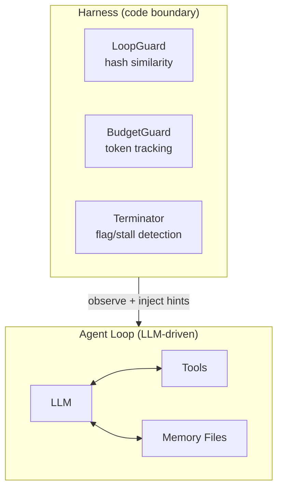

<!-- For full documentation, visit https://github.com/yaoyue123/openhack -->

# OpenHack

English | [中文](./README.zh-CN.md)

[](https://www.npmjs.com/package/openhack)
[](./LICENSE)
[](https://nodejs.org/)

AI agent that solves CTF challenges. Harness-controlled, memory-persistent, skill-aware.

> **Requires an LLM backend.** Works with Ollama, OpenAI, or any OpenAI-compatible API.

<!-- TODO: Add demo GIF here — a terminal recording showing `openhack solve ./challenge` auto-triaging a crypto challenge, running tools, and finding the flag. -->

## Quick Start

```bash
npm install -g openhack
openhack init          # defaults to http://localhost:11434/v1 (Ollama)
openhack solve ./challenge
```

That's it. With Ollama running locally, no extra config is needed.

## Features

- 🎯 **Specialized agents** — seven categories: triage, crypto, pwn, web, reverse, forensics, misc. Auto-routed or manually selected.
- 🛡️ **Harness safety layer** — LoopGuard catches repeated tool calls, BudgetGuard compresses context before overflow, Terminator stops on flag detection or stalled progress.
- 🧠 **Persistent memory** — state, findings, failed paths, and attack logs survive across sessions. Pause and resume without losing context.
- 🔧 **13 built-in tools** — shell, read, write, edit, glob, grep, webfetch, flag, python, plus memory and state management.
- 📋 **Skill system** — category-specific SKILL.md reference files that inject domain expertise into agent prompts.
- 🔌 **MCP integration** — Model Context Protocol servers for forensics, pwn, web, and reverse engineering.

## Architecture



<details>
<summary>ASCII diagram (for npm / terminal viewers)</summary>

```
┌──────────────────────────────────────────────┐
│                Harness (code)                 │
│  ┌───────────┐ ┌──────────┐ ┌─────────────┐ │
│  │ LoopGuard  │ │ Budget   │ │ Terminator  │ │
│  │ (hashing)  │ │ (tokens) │ │ (flag/state)│ │
│  └─────┬─────┘ └────┬─────┘ └──────┬──────┘ │
│        └─────────┬───┘──────────────┘         │
│                  │ observe, inject hints      │
│  ┌───────────────▼────────────────────────┐   │
│  │         Agent Loop (natural language)  │   │
│  │  state.md <-> LLM <-> Tools <-> memory/│   │
│  └────────────────────────────────────────┘   │
└──────────────────────────────────────────────┘
```
</details>

## CLI Reference

| Command | Description |
|---|---|
| `openhack init` | Interactive config wizard |
| `openhack chat <message>` | Send a message to the agent |
| `openhack solve [path]` | Auto-triage and solve a challenge |
| `openhack sessions` | List saved sessions |
| `openhack resume <id>` | Resume a paused session |
| `openhack skills list` | Show loaded skills |
| `openhack config get <key>` | Read a config value |
| `openhack config set <key> <value>` | Write a config value |
| `openhack config list` | Print full config |
| `openhack config validate` | Check for config issues |

<details>
<summary>Solve command flags</summary>

```bash
openhack solve ./challenge --category crypto    # skip triage, use crypto agent
openhack solve ./challenge --agent pwn          # use specific agent
openhack solve ./challenge --model gpt-4        # override model
```
</details>

## Comparison

| | **OpenHack** | ctf-agent | PentestGPT |
|---|---|---|---|
| Agent specialization (7 categories) | ✓ | ✗ | ✗ |
| Persistent memory across sessions | ✓ | ✗ | ✗ |
| Harness safety (loop/budget/termination) | ✓ | ✗ | partial |
| LLM backend freedom (Ollama, OpenAI, etc.) | ✓ | ✓ | partial |
| MCP tool integration | ✓ | ✗ | ✗ |
| Fully self-hosted | ✓ | ✓ | ✗ |

## Built-in Tools

| Tool | What it does |
|---|---|
| `bash` | Run shell commands |
| `read` | Read file contents |
| `write` | Create or overwrite files |
| `edit` | Targeted string replacements |
| `glob` | Find files by pattern |
| `grep` | Search file contents (regex) |
| `webfetch` | Fetch content from a URL |
| `flag` | Submit a discovered flag |
| `python` | Execute Python code |
| `state-read` | Read current state.md |
| `state-write` | Update state.md |
| `memory-query` | Read from memory files |
| `memory-write` | Write to memory files |

<details>
<summary>Configuration reference</summary>

Config lives at `~/.config/openhack/openhack.jsonc` (JSON with comments):

```jsonc
{
  "llm": {
    "baseURL": "http://localhost:11434/v1",
    "model": "default",
    "apiKey": ""
  },
  "agent": {
    "maxSteps": 25,
    "timeout": 300
  },
  "harness": {
    "loop": {
      "windowSize": 5,
      "similarityThreshold": 0.8,
      "maxRepeats": 3
    },
    "budget": {
      "maxTokens": 100000,
      "compressThreshold": 70000,
      "preserveRecentSteps": 5
    },
    "terminator": {
      "maxStepsWithoutProgress": 10
    }
  },
  "memory": {
    "enabled": true,
    "autoLog": true
  },
  "docker": {
    "enabled": true,
    "preferContainer": true,
    "image": null
  },
  "mcpServers": {},
  "permissions": {
    "default": ["ask"],
    "rules": [
      { "tool": "read", "pattern": "*", "action": "allow" },
      { "tool": "bash", "pattern": "*", "action": "allow" }
    ]
  }
}
```

Manage from CLI: `openhack config list`, `openhack config get llm.model`, `openhack config set agent.maxSteps 50`
</details>

<details>
<summary>Troubleshooting</summary>

| Problem | Fix |
|---|---|
| `Ollama not found` / connection refused | Start Ollama: `ollama serve`. Verify it's running at `http://localhost:11434`. |
| API key missing error | Run `openhack init` or set `OPENHACK_LLM_API_KEY` env var. |
| Token budget exceeded | Increase `harness.budget.maxTokens` or lower `compressThreshold` in config. |
| Agent loops on the same approach | Lower `harness.loop.similarityThreshold` or `maxRepeats` for earlier loop detection. |
| Config file not found | Run `openhack init` to create it, or check `~/.config/openhack/openhack.jsonc`. |
</details>

<details>
<summary>Advanced: Tuning the Harness</summary>

The Harness is three independent guards that observe the agent loop via `onStepFinish` callbacks. They never modify prompts directly.

**LoopGuard** hashes each step's tool calls and arguments using Jaccard similarity on token sets. When the last N steps exceed the similarity threshold for more than `maxRepeats` consecutive steps, it injects a system message telling the agent to switch approaches.

**BudgetGuard** estimates token usage (character length / 4) and triggers context compression when it crosses the threshold. Compression summarizes older steps while preserving the most recent ones intact.

**Terminator** watches for flag patterns (`flag{}`, `HTB{}`, `CTF{}`, `picoCTF{}`) in raw message text and monitors `state.md` phase transitions. If the agent goes N steps without a meaningful state change, it terminates the loop.

Override any guard's defaults in config under the `harness` key, or disable memory entirely with `memory.enabled: false`.
</details>

## Development

```bash
npm run dev        # run with tsx (no build)
npm run build      # tsup → dist/
npm test           # vitest run
npm run typecheck  # tsc --noEmit
```

## Contributing

See [CONTRIBUTING.md](./CONTRIBUTING.md) for guidelines.

## License

[MIT](./LICENSE)
