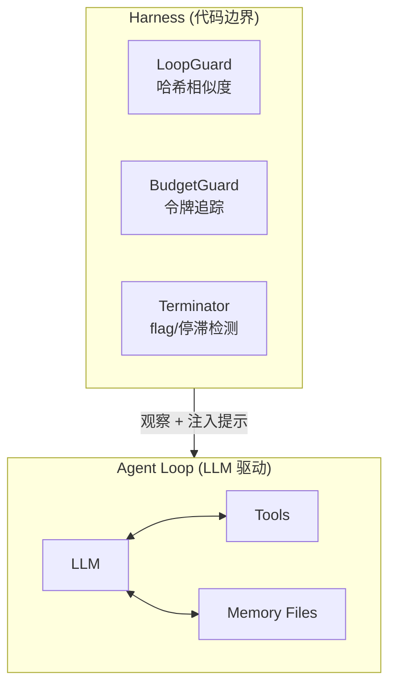

<!-- 本文档为中文版 README，与英文版保持同步。如内容不一致，以英文版为准。 -->

# OpenHack

[English](./README.md) | 中文

[](https://www.npmjs.com/package/openhack)
[](./LICENSE)
[](https://nodejs.org/)

解决 CTF 挑战的 AI 智能体。Harness 受控、记忆持久化、技能感知。

> **需要 LLM 后端。** 支持 Ollama、OpenAI 或任何兼容 OpenAI 的 API。

<!-- TODO: 添加演示 GIF — 终端录屏展示 `openhack solve ./challenge` 自动分类 crypto 挑战、运行工具并找到 flag。 -->

## 快速开始

```bash
npm install -g openhack
openhack init          # 默认使用 http://localhost:11434/v1 (Ollama)
openhack solve ./challenge
```

搞定。本地跑着 Ollama 的话，不需要额外配置。

## 功能特性

- 🎯 **专业智能体** — 七大类别：triage、crypto、pwn、web、reverse、forensics、misc。自动路由或手动选择。
- 🛡️ **Harness 安全层** — LoopGuard 捕获重复工具调用，BudgetGuard 在溢出前压缩上下文，Terminator 在检测到 flag 或进度停滞时终止。
- 🧠 **持久化记忆** — 状态、发现、失败路径和攻击日志跨会话保留。随时暂停和恢复，不丢上下文。
- 🔧 **13 个内置工具** — shell、read、write、edit、glob、grep、webfetch、flag、python，外加记忆和状态管理。
- 📋 **技能系统** — 按类别提供 SKILL.md 参考文件，将领域专业知识注入智能体提示。
- 🔌 **MCP 集成** — Model Context Protocol 服务器，覆盖 forensics、pwn、web 和逆向工程。

## 架构



<details>
<summary>ASCII 图（适用于 npm / 终端浏览）</summary>

```
┌──────────────────────────────────────────────┐
│              Harness (代码层)                 │
│  ┌───────────┐ ┌──────────┐ ┌─────────────┐ │
│  │ LoopGuard  │ │ Budget   │ │ Terminator  │ │
│  │ (哈希匹配) │ │ (令牌数) │ │ (flag/状态) │ │
│  └─────┬─────┘ └────┬─────┘ └──────┬──────┘ │
│        └─────────┬───┘──────────────┘         │
│                  │ 观察、注入提示              │
│  ┌───────────────▼────────────────────────┐   │
│  │       Agent Loop (自然语言)             │   │
│  │  state.md <-> LLM <-> Tools <-> memory/│   │
│  └────────────────────────────────────────┘   │
└──────────────────────────────────────────────┘
```
</details>

## CLI 参考

| 命令 | 说明 |
|---|---|
| `openhack init` | 交互式配置向导 |
| `openhack chat <message>` | 向智能体发送消息 |
| `openhack solve [path]` | 自动分类并解决挑战 |
| `openhack sessions` | 列出已保存的会话 |
| `openhack resume <id>` | 恢复暂停的会话 |
| `openhack skills list` | 显示已加载的技能 |
| `openhack config get <key>` | 读取配置值 |
| `openhack config set <key> <value>` | 写入配置值 |
| `openhack config list` | 打印完整配置 |
| `openhack config validate` | 检查配置问题 |

<details>
<summary>solve 命令参数</summary>

```bash
openhack solve ./challenge --category crypto    # 跳过分类，使用 crypto 智能体
openhack solve ./challenge --agent pwn          # 使用指定智能体
openhack solve ./challenge --model gpt-4        # 覆盖模型
```
</details>

## 对比

| | **OpenHack** | ctf-agent | PentestGPT |
|---|---|---|---|
| 智能体专业化（7 个类别） | ✓ | ✗ | ✗ |
| 跨会话持久化记忆 | ✓ | ✗ | ✗ |
| Harness 安全（循环/预算/终止） | ✓ | ✗ | 部分 |
| LLM 后端自由（Ollama、OpenAI 等） | ✓ | ✓ | 部分 |
| MCP 工具集成 | ✓ | ✗ | ✗ |
| 完全自托管 | ✓ | ✓ | ✗ |

## 内置工具

| 工具 | 功能 |
|---|---|
| `bash` | 运行 shell 命令 |
| `read` | 读取文件内容 |
| `write` | 创建或覆盖文件 |
| `edit` | 精确字符串替换 |
| `glob` | 按模式查找文件 |
| `grep` | 用正则搜索文件内容 |
| `webfetch` | 从 URL 获取内容 |
| `flag` | 提交发现的 flag |
| `python` | 执行 Python 代码 |
| `state-read` | 读取当前 state.md |
| `state-write` | 更新 state.md |
| `memory-query` | 从记忆文件读取 |
| `memory-write` | 写入记忆文件 |

<details>
<summary>配置参考</summary>

配置文件位于 `~/.config/openhack/openhack.jsonc`（支持注释的 JSON）：

```jsonc
{
  "llm": {
    "baseURL": "http://localhost:11434/v1",
    "model": "default",
    "apiKey": ""
  },
  "agent": {
    "maxSteps": 25,      // 最大工具调用迭代次数
    "timeout": 300       // 超时秒数
  },
  "harness": {
    "loop": {
      "windowSize": 5,             // 比较窗口大小
      "similarityThreshold": 0.8,  // 哈希相似度阈值
      "maxRepeats": 3              // 连续匹配后触发的次数
    },
    "budget": {
      "maxTokens": 100000,
      "compressThreshold": 70000,
      "preserveRecentSteps": 5
    },
    "terminator": {
      "maxStepsWithoutProgress": 10
    }
  },
  "memory": {
    "enabled": true,
    "autoLog": true
  },
  "docker": {
    "enabled": true,
    "preferContainer": true,
    "image": null       // 使用默认镜像
  },
  "mcpServers": {},     // 在此添加 MCP 服务器
  "permissions": {
    "default": ["ask"],
    "rules": [
      { "tool": "read", "pattern": "*", "action": "allow" },
      { "tool": "bash", "pattern": "*", "action": "allow" }
    ]
  }
}
```

通过 CLI 管理：`openhack config list`、`openhack config get llm.model`、`openhack config set agent.maxSteps 50`
</details>

<details>
<summary>故障排除</summary>

| 问题 | 解决方法 |
|---|---|
| `Ollama not found` / 连接被拒绝 | 启动 Ollama：`ollama serve`。确认运行在 `http://localhost:11434`。 |
| API key 缺失错误 | 运行 `openhack init`，或设置 `OPENHACK_LLM_API_KEY` 环境变量。 |
| 令牌预算超限 | 增大 `harness.budget.maxTokens`，或降低 `compressThreshold`。 |
| 智能体反复尝试同一种方法 | 降低 `harness.loop.similarityThreshold` 或 `maxRepeats`，提前检测循环。 |
| 配置文件找不到 | 运行 `openhack init` 创建，或检查 `~/.config/openhack/openhack.jsonc`。 |
</details>

<details>
<summary>高级：调整 Harness</summary>

Harness 由三个独立的防护组成，它们通过 `onStepFinish` 回调观察智能体循环。防护不直接修改提示。

**LoopGuard** 对每一步的工具调用和参数做哈希，使用 token 集合上的 Jaccard 相似度来比较。当最近 N 步的相似度连续超过 `maxRepeats` 步都高于阈值时，注入系统消息让智能体切换方法。

**BudgetGuard** 估算 token 用量（字符长度 / 4），超过阈值时触发上下文压缩。压缩会将较早的步骤摘要化，最近的步骤完整保留。

**Terminator** 监控原始消息文本中的 flag 模式（`flag{}`、`HTB{}`、`CTF{}`、`picoCTF{}`），并跟踪 `state.md` 的阶段转换。如果智能体连续 N 步没有有意义的状态变化，就终止循环。

在配置的 `harness` 键下可以覆盖任何防护的默认值，也可以通过 `memory.enabled: false` 完全禁用记忆。
</details>

## 开发

```bash
npm run dev        # 用 tsx 运行（无需构建）
npm run build      # tsup → dist/
npm test           # vitest run
npm run typecheck  # tsc --noEmit
```

## 贡献

查看 [CONTRIBUTING.md](./CONTRIBUTING.md) 了解贡献指南。

## 许可证

[MIT](./LICENSE)
